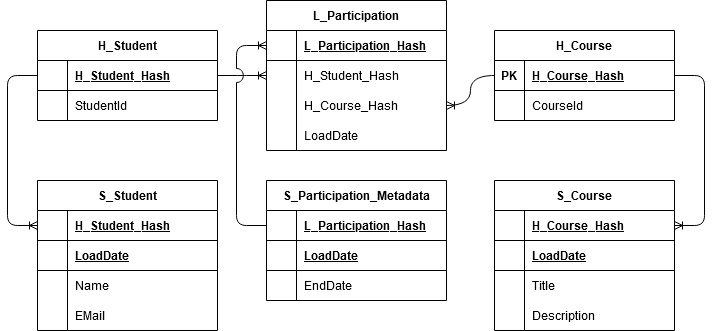

# HEAL.Entities.DataAccess.EFCore.DWH.DV2
DataVault is a DWH modelling technique that offers easy extendibility (for adding new data sources or extending existing tables with new attributes) and availability of time slices of the saved data.

The core components of the DataVault model are **Hubs, Links and Satellites** which will be described briefly.


A simple ER Diagram for managing student participation in courses therefore has to be 'transformed' into the following relational schema:



## DataVault - Hub
A Hub represents one domain specific object. The hub table itself only saves the single business key identifying this instance. No additional information of the business-object is stored in the hub.

## DataVault - Links
A Link stores the relation between two or more hubs and their business entities. 
The link can have satellites attached describing the relationship in more details.
By the nature of a the link table every relationship between objects is capable of representing of n:m cardinality even if that is not the case in the 'natural/business' world. This gives the model additional flexibility to change.

## DataVault - Satellite
A Satellite contains the actual descriptive data connected to a business key. But does not store the business key itself. E.g. contains the attributes (name, birthdate, etc.) of the person. Data is stored in a time-slice manner as the reference hash and the load date of the information together form the primary key of a satellite.

# Automated Key Calculation
The repository takes over the automated key calculation for the user. Each DataVault repository expects a `Func<string,string>` constructor parameter in order to calculate the Hash key for the string representation of the business key. 

```C#
using (var context = TestDwhDbContext.CreateDWHDbContext()) {
  var testRepo = new HubRepository<H_TestHub_Default>(context,
                                                      HashFunctions.MD5,
                                                      null,
                                                      DVKeyCaching.Disabled);
  var loadDate = DateTime.Now;

  //single insert
  var test = testRepo.Insert(AdditionalTest, loadDate);
  Assert.Equal(HashFunctions.MD5(test.GetBusinessKeyString()), test.PrimaryKey);
}
```
The `GetBusinessKeyString()` method is one of the few must have methods for the Hub, Link and Satellite DomainObject interfaces.

This is especially useful in an application where Dependency Injection is used as the Hash function can be defined once for all occurrences.

# Key Caching
Especially with large Link or Hub Tables (several million entries) is becomes undesirable, from a performance perspective, to have primary key or unique constraint enforce the uniqueness of the Hash at insert. 

However in some scenarios we encountered that we still need some part of the technology stack that is able to check and enforce this uniqueness to ease development. E.g. developer is able to write a bulk insert statement and does not have to worry about the actual current state of the database. 

For these cases, the Hub and Link Repositories offer Caching of primary key hashes. This is also available for Value Hash Caching, a technique done for satellites to prevent insertion of a new row when the value hash has not changed since the last data insert.

```C#
using (var context = TestDwhDbContext.CreateDWHDbContext()) {
  var cache = new BasePrimaryKeyCache();
  var testRepo = new HubRepository<H_TestHub_Default>(context,
                                                      HashFunctions.MD5,
                                                      cache,
                                                      DVKeyCaching.Enabled);
  var loadDate = DateTime.Now;

  //single insert
  testRepo.Insert(AdditionalTest, loadDate);

  // same key again - insert prevented by the primary key hash
  testRepo.Insert(AdditionalTest, loadDate);

  var list = testRepo.Get(x => x.TestNr == AdditionalTest.TestNr);
  Assert.NotNull(list);
  Assert.Single(list);
}
```

# Audit Information
As depicted in the ER Diagram for DataVault V2 the minimal required audit information is the entity load date as it's essential for data slice building. But DataVault V2 defines some additional audit information such as the `RecordSource` or the `LoadedBy` which provide information about the actual data source from which the entry was pulled and e.g. version information about the load process or it's permission set through LoadedBy. 

||S_Student|
|-|---------|
||H_Student_Hash|
||LoadDate|
||RecordSource|
||LoadedBy
||Name|
||EMail|

This additional information can be stored either as additional attributes for each individual table or in a separate table 

||S_Student||AuditInformation|
|-|---------|-|-|
||H_Student_Hash||Id|
||LoadDate||RecordSource|
||Name||LoadedBy|
||EMail|||
||AuditInformationID|||

The interfaces `IStoreLoadInformation` and `IReferenceLoadInformation` differentiate between those two design decisions. 

```C#
//references load information
public class H_TestHub_References : H_TestHub, IReferenceLoadInformation {
  ...
  public H_TestHub_References(string testNr, long loadReference) : base(testNr) {
      LoadReference = loadReference;
  }
  public long LoadReference { get; set; }
}
//stores load information
public class S_TestSatellite_Stores : S_TestSatellite, IStoreLoadInformation {
  ...
  public S_TestSatellite_Stores(int value, string testNr, string recordSource, string loadedBy) : base(value, testNr) {
      RecordSource = recordSource;
      LoadedBy = loadedBy;
  }

  public string RecordSource { get; set; }
  public string LoadedBy { get; set; }
}
```

But those interfaces can even be used when inserting or updating entities through the repository. The repository method will extract the necessary information from the passed argument for you and replace this information in the target entity.

This is especially useful for bulk inserts.

```C#
//stores load information
var LoadInfo1 = new LoadInformation("RecordSource1", "LoadedBy1");
var Hub1Satellite1 = satelliteRepo.Insert(Hub1Satellite1, loadDate, loadInformation: LoadInfo1);

//references load information
referenceRepo.Insert(LoadInfo1);
satelliteRepo.Insert(Hub1Satellite1, loadDate, loadReference: LoadInfo1);
```

# Link Timeline
Each link needs an additional satellite table in order to be able to track the full timeline of a relationship as relationships can be removed and added again at a later time. 

The `LinkTimelineRepository<TLink, TSatelliteTimeline>` tracks one business entity, the *Link*, but two database tables/objects at once. It ensures that e.g. if a link is deleted, that it's most recent timeline-satellite entry receives a current `EndDate` entry or that a new timeline-satellite entry is created once a link is inserted.

```C#
public class LinkTimelineRepository<TLink, TSatelliteTimeline> : LinkTimelineRepository<TLink,
                                                                              string,
                                                                              TSatelliteTimeline,
                                                                              long>
                where TLink : class, ILinkTimeline<string, TSatelliteTimeline>
                where TSatelliteTimeline : class, ITimelineSatellite<string>, new() {

  public LinkTimelineRepository(DwhDbContext context
                                  , DataVaultHashFunction<string> hashFunction
                                  , IPrimaryKeyCache keyCache = null
                                  , DVKeyCaching useKeyCaching = DVKeyCaching.Disabled
                                  , ILogger<LinkTimelineRepository<TLink, TSatelliteTimeline>> logger = null)
                  : base(context, hashFunction, keyCache, useKeyCaching, logger) {
  }
}
```